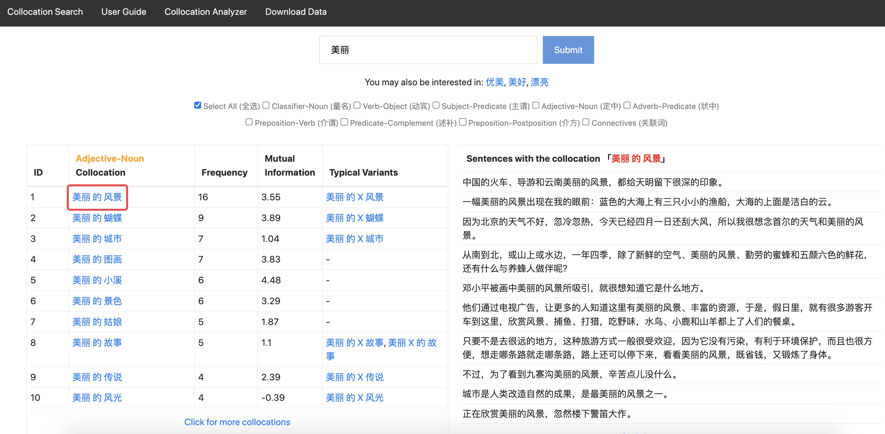
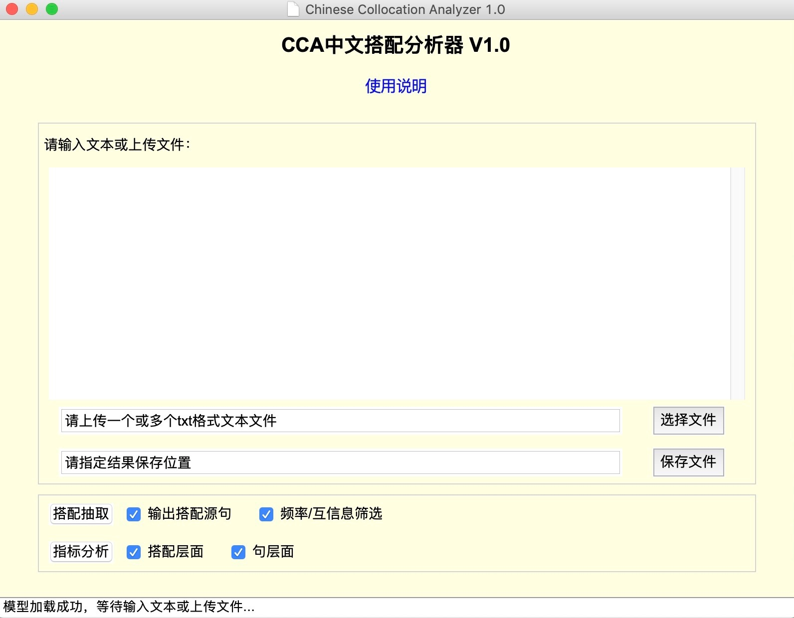

# 中文搭配资源库

本项目开源了如下论文所涉及的数据和源码：   
This project releases the data and codes from the following articles:

- 胡韧奋, 肖航. 面向二语教学的汉语搭配知识库构建及其应用研究. 语言文字应用. 2019(1).     
- 胡韧奋. 基于搭配的句法复杂度指标及其与汉语二语写作质量关系研究. 语言文字应用, 2021(1).      
- Renfen Hu, Jifeng Wu, and Xiaofei Lu. Word-combination-based Measures of Phraseological Diversity, Sophistication and Complexity and Their Relationship to L2 Chinese Proficiency and Writing Quality. <em>Language Learning</em>,  2022, 72(4).

为了更好地服务中文搭配教学及研究，我们开发了一系列面向中文学习者、教师和研究者的工具及知识库，包括：
- [Chinese Collocation Assistant 中文搭配助手网站](#1-chinese-collocation-assistant-中文搭配助手网站)
- [Chinese Collocation Analyzer 中文搭配分析器](#2-chinese-collocation-analyzer-中文搭配分析器)
- [Chinese Collocation Knowledgebase 中文搭配知识库](#3-chinese-collocation-knowledgebase-中文搭配知识库)

## 1. Chinese Collocation Assistant 中文搭配助手网站

访问地址：[`http://cca.irishu.cn/`](http://cca.irishu.cn/)

功能说明：该网站面向汉语教学需求，支持以关键词检索搭配，提供搭配在经典汉语教材中的频次、互信息及例句，具体功能可参考网站用户手册（User Guide）。

[](http://cca.irishu.cn/)

[](http://cca.irishu.cn/)


## 2. Chinese Collocation Analyzer 中文搭配分析器

填写[`试用申请`](https://www.wjx.top/vm/QD6GdYJ.aspx#)后可获得中文搭配分析器下载地址。 

中文搭配分析器提供了Windows, MacOS (Intel), MacOS (Apple M1)三种客户端程序，支持现代汉语句法搭配自动抽取和句法复杂度指标计算。




### 2.1 使用说明

(1) 下载系统对应的程序，解压缩后无须安装，直接打开。<b>Mac OS系统</b>首次运行程序如提示开发者身份未验证，请`右键`点击`打开`，为方便后续使用，还可将程序拖至Mac应用程序目录，之后便可通过`启动台`快捷访问CCA。

(2) 在文本框中输入文本，或者点击`选择文件`按钮上传txt格式文件，支持上传多个文件进行批量处理。为确保程序运行顺畅，文本框输入限定最长<b>10万字符</b>，上传文件限定最长<b>100万字符/文件</b>。

(3) 点击`保存文件`按钮指定结果输出位置，默认结果保存为xlsx格式表格文件。

(4) 点击`搭配抽取`或者`指标分析`按钮运行程序，程序运行进度在底部状态栏显示。程序处理速度约<b>1万字/秒</b>（与系统配置有关），如需处理较大规模语料，请耐心关注状态栏提示，运行过程中<b>切勿</b>点击其他按钮。

### 2.2 搭配抽取结果

搭配定义及抽取方法来自论文胡韧奋和肖航（2019），工具支持自动抽取如下类型搭配：

| 跨语言通用类型 | 示例 | 
| :-----| :----  | 
| 动宾搭配 (Verb-Object, VO) | 喜欢 看书；唱 着 歌；学 到 了 技术 | 
| 主谓搭配 (Subject-Predicate, SP) | 歌曲 流行；戒指 找 回来 了 | 
| 形名搭配 (Adjective-Noun, AN) | 著名 大学；专业 书籍；卑鄙 的 人 | 
| 状中搭配 (Adverb-Predicate, AP) | 突然 改变；有效 地 提高；非常 漂亮 | 
| **汉语特有类型** | **示例** | 
| 量名搭配 (Classifier-Noun, CN*) | 条 河；张 纸 | 
| 框式介词搭配 (Preposition-Postposition, PP*) | 在 X 上；像 X 似的；当 X 时 | 
| 介动搭配 (Preposition-Verb, PV*) | 把 X 解决；被 X 吃 完 了 | 
| 述补搭配 (Predicate-Complement, PC*) | 吃 饱；玩 得 愉快；试 了 三 遍 | 

**注1：** 复选框`输出搭配源句`控制是否输出搭配所在的源句。   
**注2：** 复选框`频率/互信息筛选`控制是否根据外部参考语料库的频率和互信息对所抽取的搭配进行筛选，此处使用的参考语料库为中文维基百科（规模1.38亿词），筛选标准为：该搭配在中文维基百科语料库中的频次>=3、互信息>=0。


### 2.3 指标分析结果

指标定义及抽取方法来自论文胡韧奋（2021）、Hu, Wu & Lu (2022)，包括句层面和短语层面共计25个指标，如下表所示：

| 指标 | 含义 | 指标 | 含义 |
| :-----| :----  | :----  | :----  | 
| MLS | 平均大句长 | MLC | 平均小句长 |
| MLTU | 平均T单位长 |  NCPS | 平均小句数 |
| NTPS | 平均T单位数 | | |
| TOTAL_RTTR | 整体搭配多样性 | LOWFREQ_RATIO | 低频搭配比例 |
| UNIQUE_RTTR | 特殊搭配多样性 | UNIQUE_RATIO | 特殊搭配比例 |
| VO_RTTR | 动宾搭配多样性 | VO_RATIO | 动宾搭配比例 |
| SP_RTTR | 主谓搭配多样性 | SP_RATIO | 主谓搭配比例 |
| AN_RTTR | 形名搭配多样性 | AN_RATIO | 形名搭配比例 |
| AP_RTTR | 状中搭配多样性 | AP_RATIO | 状中搭配比例 |
| CN_RTTR | 量名搭配多样性 | CN_RATIO | 量名搭配比例 |
| PP_RTTR | 框式介词搭配多样性 | PP_RATIO | 框式介词搭配比例 |
| PV_RTTR | 介动搭配多样性 | PV_RATIO | 介动搭配比例 |
| PC_RTTR | 述补搭配多样性 | PC_RATIO | 述补搭配比例 |

**注1：** 当用户在文本框中输入时，以框中全部内容为指标分析对象；当用户上传文件时，以每个文件中的内容为一篇分析对象，如需分析多篇文本，请将其分别存储在多个txt文件中。    
**注2：** 复选框`搭配层面`指向基于搭配多样性和复杂性的指标，复选框`句层面`指向基于大句、小句和T单位的指标。


## 3. Chinese Collocation Knowledgebase 中文搭配知识库

本项目开源了搭配知识库原始数据，包括：

* **edu_collocation_data.xlsx**: 从汉语分级阅读语料库子库（规模约240万词）中自动抽取的搭配数据。
* **wiki_collocation_data.txt.zip**：从中文维基百科（规模约1.38亿词）中自动抽取的搭配数据。

[下载说明](https://github.com/iris2hu/Chinese-collocation-complexity/blob/main/collocation_data/collocation_data.md)

## 4. 句法复杂度分析Python源码

**环境 (Environments)**

*   **`Python 3.7+`**
*   **[`pyltp`](https://github.com/HIT-SCIR/pyltp)**

**运行 (Run the codes)**

```python
python main.py -i ./samples/ -o result.csv -mp path_to_LTP_models
```
