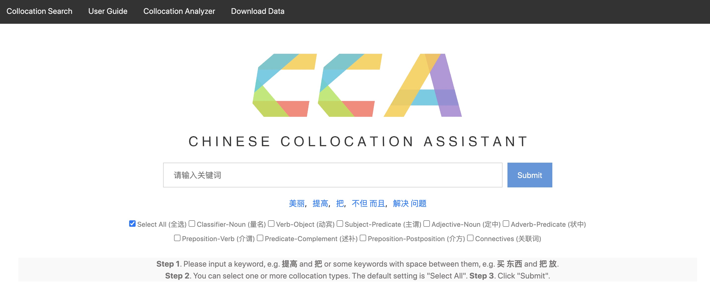

# 中文搭配资源库

本项目开源了如下论文所涉及的搭配知识库、搭配自动抽取方法及句法复杂度指标计算方法：   
This project releases the data and codes from the following articles:

(1) 胡韧奋, 肖航. 面向二语教学的汉语搭配知识库构建及其应用研究. 语言文字应用. 2019(1). 

(2) 胡韧奋. 基于搭配的句法复杂度指标及其与汉语二语写作质量关系研究. 语言文字应用, 2021(1).   

(3) Renfen Hu, Jifeng Wu, and Xiaofei Lu. Word-combination-based Measures of Phraseological Diversity, Sophistication and Complexity and Their Relationship to L2 Chinese Proficiency and Writing Quality. <em>Language Learning</em>,  2022, 72(4).

为了更好地服务中文搭配教学及研究，我们开发了一系列面向中文学习者、教师和研究者的工具及知识库，包括：CCA中文搭配助手网站、中文搭配分析器、中文搭配知识库，其使用说明如下。

## Chinese Collocation Assistant 中文搭配助手网站

访问地址：[`http://cca.irishu.cn/`](http://cca.irishu.cn/)

功能说明：该网站面向汉语教学需求，支持以关键词检索搭配，提供搭配在经典汉语教材中的频次、互信息及例句，具体功能可参考论文网站用户手册（User Guide）。

[](http://cca.irishu.cn/)

[](http://cca.irishu.cn/)


## Chinese Collocation Analyzer 中文搭配分析器

中文搭配分析器提供了Windows, MacOS (Intel芯片), MacOS (Apple M1芯片)三种客户端程序，支持搭配自动抽取和句法复杂度指标计算。

V1.0下载地址：[`https://pan.bnu.edu.cn/l/h1qSHz`](https://pan.bnu.edu.cn/l/h1qSHz)


**1. 使用说明**

第一步：在文本框中输入文本，或者点击“选择文件”按钮上传txt格式文件，支持上传多个文件进行批量处理。为确保程序运行顺畅，文本框输入限定最长10万字符，上传文件限定最长100万字符/文件。

第二步：点击“保存文件”指定结果输出位置，

第三步：点击“搭配抽取”或者“指标分析”按钮运行程序。
- 搭配抽取：复选框“输出搭配源句”默认选中，将输出搭配及其所在的源句；复选框“频率/互信息筛选”默认选中，

**2. 搭配抽取结果**


**3. 指标分析结果**


## Chinese Collocation Knowledgebase 中文搭配知识库

本项目开源了搭配知识库原始数据，包括：

* **textbook_collocation_data.xlsx**: 从二语教材语料库（规模约240万词）中自动抽取的搭配数据。
* **wiki_collocation_data.txt.zip**：从中文维基百科（规模约1.38亿词）中自动抽取的搭配数据。

[下载说明](https://github.com/iris2hu/Chinese-collocation-complexity/blob/main/collocation_data/collocation_data.md)

## 运行

**环境 (Environments)**

*   **`Python 3.7+`**
*   **[`pyltp`](https://github.com/HIT-SCIR/pyltp)**

**运行 (Run the codes)**

```python
python main.py -i ./samples/ -o result.csv -mp path_to_LTP_models
```
